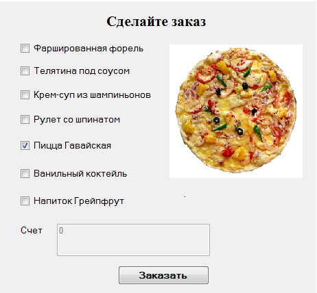

## Работа управляющего элемента checkbox в JavaScript
Флажки используются в случае, когда из предложенных вариантов можно выбрать как один, так и несколько. Флажки создаются с помощью элемента ```<input type="checkbox">```. Обязательным параметром является параметр value, значение которого передается на обработку в случае выбора. Отличительную особенность флажка составляет свойство checked, которое в отмеченном состоянии принимает значение true.
1.	Написать программу «Меню» для расчета стоимости электронного заказа по меню. Список блюд выполнить с помощью компонента checkbox.
2.	Рекомендуемая компоновка формы программы представлена на рисунке.

3.	Каждое блюдо из меню имеет свою стоимость. Стоимость каждого блюда должна быть записана в массив. Допустим, цены на блюда будут следующие:
•	Фаршированная форель - 369 руб.
•	Телятина под соусом - 349 руб.
•	Крем-суп из шампиньонов - 189 руб.
•	Рулет со шпинатом - 179 руб.
•	Пицца Гавайская - 299 руб.
•	Ванильный коктейль - 149 руб.
•	Напиток Грейпфрут - 199 руб.
4.	При выборе какого-либо блюда должна автоматически высчитываться стоимость заказа (при установлении флажка – счет должен увеличиваться на стоимость блюда).
5.	При выборе какого-либо блюда должна появиться картинка с его изображением.
6.	Если отказываемся от блюда (снимаем галочку), то стоимость заказа должна уменьшиться.
7.	Поле Счет должно быть заблокировано для ввода данных.
8.	При нажатии на кнопку «Заказать» должно появляться сообщение об успешном заказе. В сообщении должен быть указан список выбранных блюд с ценой и общая стоимость заказа.
9.	Если не выбрано блюд, то при нажатии на кнопку «Заказать» выводится диалоговое окно с предупреждением.
