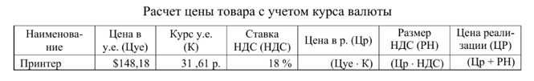

## Работа с текстовыми полями формы в JavaScript
Разработать пользовательскую форму, предназначенную для выполнения расчетов, соответствующих варианту задания. Форма должна содержать:
1. Надписи и текстовые поля, соответствующие наименованиям столбцов таблицы.
2. Кнопку «Вычислить», при нажатии на которую, считывается исходная информация из соответствующих текстовых полей, производятся необходимые вычисления и вывод результатов в предназначенные для них текстовые поля. Кнопка становится доступной только после ввода всех данных в поля ввода.
3. Кнопку «Очистить», при нажатии на которую удаляется информация, содержащаяся в текстовых полях формы.
4. Кнопку «Выход», предназначенную для закрытия формы.

  **Важно!**  
Атрибут disabled блокирует элемент HTML формы, то есть делает его неактивным. В случае кнопки блокировка означает, что на кнопку нельзя будет нажать.

