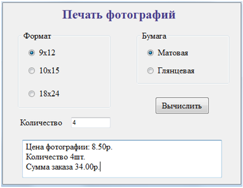

## Работа управляющего элемента RadioButton в JavaScript
Разработайте форму согласно варианту. Пример формы, приставлен на рисунке:
 
**Важно!**

При создании группы переключателей их атрибут name должен иметь одно и то же имя, то есть переключатели образуют группу. Поскольку переключателей может быть много, то при прикреплении к ним обработчика события надо пробежаться по всему массиву переключателей, который можно получить по имени группы: 
```JS
for (var i = 0; i < имя_формы.имя_поля.length; i++) {
   if(имя_поля.checked) {выполняемые действия};
}

```
Каждый переключатель имеет свойство checked, которое возвращает значение true, если переключатель выбран. Например, отметим первый переключатель: имя_формы.имя_поля[0].checked = true;

Хозяйственный магазин:<br>
Написать приложение для покупки товара и подсчета общей стоимости. Вводится название товара, цена и количество. Указать вид оплаты: наличные, карта Visa (скидка 5%), карта MasterCard (скидка 3%), карта Тинькофф (скидка 5% и кэшбэк 3 % от стоимости покупки).


