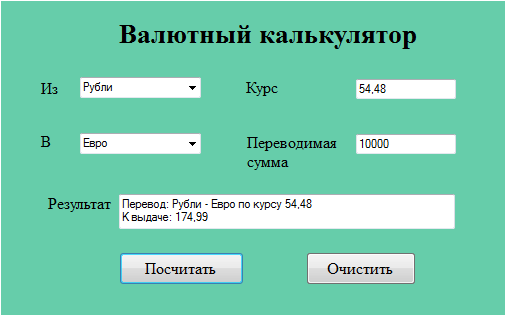

## Работа управляющего элемента select в JavaScript
Для создания списка используется html-элемент select. С его помощью можно создавать выпадающие списки, с ординарным или множественным выбором.
Атрибут size позволяет установить, сколько элементов будут отображаться одномоментно в списке. Если установить атрибут multiple, то в списке можно выбрать сразу несколько значений.
Каждый элемент списка представлен html-элементом option, у которого есть отображаемая метка и значения в виде атрибута value.

Все элементы списка в javascript доступны через коллекцию options. Каждый объект имеет свойства: index (индекс в коллекции options), text (отображаемый текст) и value (значение элемента).

1.	Написать программу «Валютный калькулятор», в которой на основании введенной информации о виде валюты и ее текущем курсе дает возможность произвести перевод денег из одной валюты в другую по текущему курсу.
2.	Рекомендуемая компоновка формы программы представлена на рисунке.

3.	В списках валют используйте следующие значения:
*	Рубли
*	Евро
*	Доллар
*	Фунт стерлингов
*	Японская иена
*	Китайский юань
*	Украинская гривна
4.	Поля «Курс» и «Переводимая сумма» должны быть с проверкой вводимых данных для предотвращения ввода нечисловых значений и ввода только одного символа разделителя целой и дробной части (точка или запятая).
5.	В поле «Результат» выводить значение с округление до двух знаков после запятой.
6.	Кнопка “Посчитать” становится доступной только после ввода данных в поля редактирования.
7.	Кнопка “Очистить” должна вернуть все элементы в начальное состояние и очистить все поля формы.
