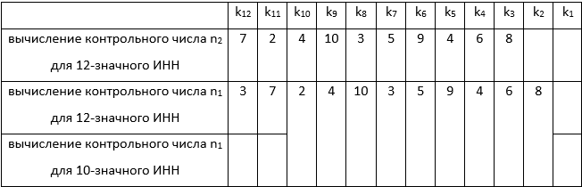

## Использование регулярных выражений JavaScript
Проверка значений, введенных пользователем в поля формы для регистрации. Для выполнения работы необходимо создать веб-страницу, содержащую форму с заданными полями.
### Форма регистрации пользователей
* Реализуйте форму в соответствии с приведенными критериями:
1. Фамилия (текстовое поле от 3-х до 20 символов без цифр, первая буква заглавная)
2. Логин (текстовое поле от 3-х до 10 символов и состоит из латинских символов и цифр)
3. Пароль (содержит по крайней мере одну букву, по крайней мере одну прописную букву, по крайней мере одну цифру, не менее 8 символов)
4. Подтвердите пароль (должно быть равно полю с паролем)
5. Дата рождения (в формате день.месяц.год или день/месяц/год)
6. Телефон (в виде (555) 555-5555 или (555) 55-55-55 с пробелами или без)
7. ИНН
8. Пол (обязательно с помощью RADIO: М, Ж )
9. Кнопка для отправки информации
10. Кнопка для очистки формы

### Алгоритм проверки контрольного числа ИНН:
Бывают 10-значные (1 контрольная цифра в конце) и 12-значные (2 контрольные цифры в конце).

Проверку ИНН удобнее проводить, вычисляя контрольные числа:  
Шаг 1 (только для 12-значного ИНН). Контрольное число n2 есть остаток от деления на 11 суммы из цифр номера, умноженных на соответствующие коэффициенты из таблицы (из строки «вычисление контрольного числа n2»). Если остаток есть 10, то n2 = 0. 
Шаг 2. Контрольное число n1 есть остаток от деления на 11 суммы из цифр номера, умноженных на соответствующие коэффициенты из таблицы (из строки «вычисление контрольного числа n1»). Если остаток есть 10, то n1 = 0.

Примеры: 
ИНН 500100732259 — 12 цифр. 
Шаг 1: 5 * 7 + 0 * 2 + 0 * 4 + 1 * 10 + 0 * 3 + 0 * 5 + 7 * 9 + 3 * 4 + 2 * 6 + 2 * 8 = 148 
148 = 11 * 13 + 5(остаток); совпадает 
Шаг 2: 5 * 3 + 0 * 7 + 0 * 2 + 1 * 4 + 0 * 10 + 0 * 3 + 7 * 5 + 3 * 9 + 2 * 4 + 2 * 6 + 5 * 8 = 141 
141 = 11 * 12 + 9(остаток); совпадает 
Оба контрольных числа совпадают, номер правильный.  
ИНН 7830002293 — 10 цифр. 
Шаг 2: 7 * 2 + 8 * 4 + 3 * 10 + 0 * 3 + 0 * 5 + 0 * 9 + 2 * 4 + 2 * 6 + 9 * 8 = 168 
168 = 11 * 15 + 3(остаток) Контрольное число совпадает, номер правильный. 

* Кнопка для отправки формы должна стать активной, если правильно заполнены все поля формы.
* Для каждого текстового поля осуществить проверку корректности ввода данных c использованием регулярных выражений.
