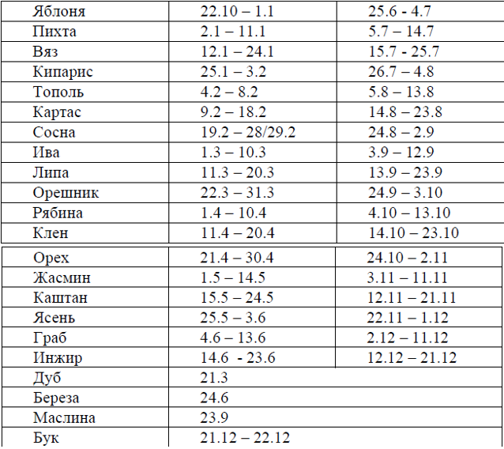

1. Напишите скрипт, который будет спрашивать логин (prompt).
	Если посетитель вводит «Админ», то спрашивать пароль, если нажал отмена (escape) – выводить «Вход отменён», если вводит что-то другое – «Я вас не знаю».
	Пароль проверяйте следующим образом. Если введён пароль «Чёрный Властелин», то выводить «Добро пожаловать!», иначе – «Пароль неверен», при отмене – «Вход отменён».
2. Написать программу, которая по введенному номеру месяца выводила название сезона, к которому этот месяц относится, и проверяла правильность введенного месяца.
3. В зависимости от возраста и пола выдать приветствие Здравствуй девочка, мальчик, девушка, юноша, женщина, мужчина. 
4. Составьте программу определения по дате рождения знака по календарю друидов

